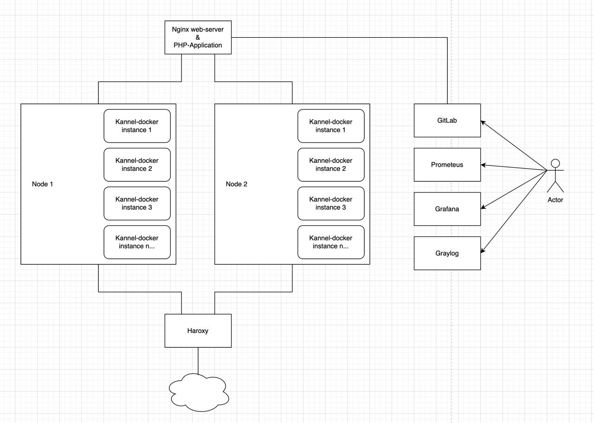

**Задание: Настройка окружения для SMS-центра с использованием SMPP и PHP**

Цель: Настроить базовое окружение для SMS-центра, который работает с SMPP и PHP, включая CI/CD, мониторинг и безопасность.

Описание задания:

**1)	Настройка сервера SMS-центра:**

•	Установите и настройте веб-сервер (Nginx/Apache) для работы с PHP-приложением.

•	Установите и настройте PHP и все необходимые модули на сервере для работы Simfony.

•	Установите и настройте отказоустойчивые ‘воркеры’ для прослушивания SMPP портов на php скриптах. 

•	*Бонусное задание запустить SMPP-сервер (например, Kannel).

Напишем Ansible плейбук решающий поставленные задачи:
```yaml
---
- name: Setup SMS Center Server
  hosts: hostname
  become: yes

  vars:
    php_version: "7.4"
    kannel_config: |
      core {
        admin-port = 13000
        admin-password = "admin_password"
        log-file = "/var/log/kannel/kannel.log"
        log-level = 0
      }

  tasks:
    - name: Install and configure web server
      apt:
        name: nginx
        state: latest

    - name: Configure Nginx for PHP application
      copy:
        dest: /etc/nginx/sites-available/contoso.com
        content: |
          server {
            listen 80;
            server_name contoso.com;
            root /var/www/contoso.com;
            index index.php;
            location ~ \.php$ {
              include snippets/fastcgi-php.conf;
              fastcgi_pass unix:/var/run/php/php{{ php_version }}-fpm.sock;
            }
          }

    - name: Enable Nginx configuration
      file:
        src: /etc/nginx/sites-available/contoso.com
        dest: /etc/nginx/sites-enabled/
        state: link

    - name: Install PHP and necessary modules for Simfony
      apt:
        name:
          - "php{{ php_version }}"
          - "php{{ php_version }}-cli"
          - "php{{ php_version }}-fpm"
          - "php{{ php_version }}-xml"
          - "php{{ php_version }}-mbstring"
          - "php{{ php_version }}-curl"
          - "php{{ php_version }}-zip"
          - composer
        state: latest

    - name: Setup workers for SMPP port listening
      supervisor:
        name: smpp_worker
        command: php ./worker.php
        autostart: yes
        autorestart: yes
        state: present

    - name: Install and configure Kannel
      block:
        - name: Install Kannel
          apt:
            name: kannel
            state: latest

        - name: Configure Kannel
          copy:
            dest: /etc/kannel/kannel.conf
            content: "{{ kannel_config }}"

        - name: Start Kannel
          systemd:
            name: kannel
            enabled: yes
            state: started
      when: install_kannel | bool

    - name: Restart Nginx
      systemd:
        name: nginx
        state: restarted
```

В данном плейбуке:

1. Установливается веб-сервер Nginx с созданием файла конфигурации для работы с PHP-приложением.
2. Установается PHP и необходимые модули для Symfony. Версию PHP можно контролировать с помощью переменной `php_version`.
3. Настраиваются'воркеры' для прослушивания SMPP портов с использованием Supervisor (для управления состоянием программ).
4. Установлен и настроен Kannel с созданием файла конфигурации из переменной `kannel_config`. Это выполняется только в том случае, если переменная `install_kannel` установлена в true.
5. Перезапускается Nginx после всех конфигураций для применения изменений.

**2)	Создание CI/CD пайплайна:**
•	Установите на сервер локальный gitlab

Для установки GitLab, Ansible предлагает использовать роль, которая позволяет автоматизировать установку и конфигурацию GitLab. Создадим плейбук для установки GitLab на сервер с использованием официальной Omnibus-пакета GitLab:

```yaml
---
- name: Install GitLab
  hosts: hostname
  become: yes

  tasks:
    - name: Download GitLab package
      get_url:
        url: https://packages.gitlab.com/install/repositories/gitlab/gitlab-ce/script.deb.sh
        dest: /tmp/script.deb.sh
        mode: '0755'

    - name: Run GitLab installation script
      command: bash /tmp/script.deb.sh

    - name: Install GitLab
      apt:
        name: gitlab-ce
        state: latest

    - name: Configure GitLab
      shell: |
        gitlab-ctl reconfigure
```

В этом плейбуке:

1. Скачивается скрипт установки GitLab с официального сайта GitLab.
2. Запускается скрипт установки, который добавляет репозиторий GitLab в систему.
3. Устанавливается GitLab через менеджер пакетов apt.
4. Конфигурируется GitLab с использованием команды `gitlab-ctl reconfigure`.

•	Используя популярный CI/CD инструмент (GitLab CI/CD), создайте простой CI/CD пайплайн для автоматической сборки и развертывания PHP-приложения на сервере SMS-центра.
•	Сделайте так, чтобы при каждом коммите в репозиторий PHP-приложения, CI/CD автоматически собирал приложение и разворачивал его на сервере.

### 1. **Создаем файл `.gitlab-ci.yml` в корне репозитория:**

```yaml
stages:
  - build
  - deploy

build_app:
  stage: build
  image: php:7.4
  script:
    - composer install --no-ansi --no-interaction --no-scripts --no-suggest --no-progress
    - ./vendor/bin/phpunit --coverage-text --colors=never
  artifacts:
    paths:
      - vendor/
    expire_in: 1 day

deploy_to_server:
  stage: deploy
  image: alpine
  script:
    - apk add --no-cache rsync openssh
    - rsync -av --delete --exclude='.git' --exclude='.gitlab-ci.yml' ./ user@git.contoso.com:/var/www/contoso.com
  only:
    - master
```

### 2. **Конфигурация GitLab CI/CD:**
- Переходим на страницу проекта в GitLab, далее нажимаем `Settings` -> `CI/CD`.
- В разделе `Variables`, добавляем переменные `SSH_PRIVATE_KEY` (приватный SSH ключ для доступа к серверу) и `SSH_PUBLIC_KEY` (публичный SSH ключ).

### 3. **Настройка сервера для развертывания:**
- Добавляем публичный SSH ключ в файл `~/.ssh/authorized_keys` на сервере.
- Убеждаемся, что сервер настроен для обслуживания PHP-приложений, и что директория `/var/www/contoso.com` настроена как корневая директория веб-сервера.

### 4. **Тестирование пайплайна:**
- Создаем коммит в репозитории и проверяем, что задания CI/CD запускаются и успешно выполняются в разделе `CI/CD Pipelines` проекта на GitLab.

### Объяснение:
- В файле `.gitlab-ci.yml`, определены два этапа: `build` и `deploy`.
- На этапе `build`, выполняется установка зависимостей и запуск юнит-тестов.
- На этапе `deploy`, используется `rsync` для копирования файлов проекта на сервер.
- Задание `deploy_to_server` запускается только для ветки `master`, что означает, что развертывание будет происходить только при коммитах в эту ветку.
- В переменных CI/CD настроены `SSH_PRIVATE_KEY` и `SSH_PUBLIC_KEY` для обеспечения доступа к серверу для развертывания.

**3)	Настройка мониторинга и логирования:**
•	Установите и настройте систему мониторинга (например, Prometheus) для мониторинга ресурсов сервера, PHP-приложения и SMPP-сервера.

### Установка и настройка Prometheus:

1. **Установка Prometheus:**
   - Скачиваем последнюю версию Prometheus (https://prometheus.io/download/).
   - Распаковываем архив, например, в `/opt/prometheus`.

2. **Конфигурация Prometheus:**
   - Создайем файл конфигурации Prometheus, например `/opt/prometheus/prometheus.yml`, со следующим содержимым:
     ```yaml
     global:
       scrape_interval: 15s

     scrape_configs:
       - job_name: 'sms-center'
         static_configs:
           - targets: ['localhost:9090']
     ```
   - Здесь `scrape_interval` устанавливает частоту сбора метрик, а `targets` указывает адреса для сбора метрик.

3. **Запуск Prometheus:**
   - Запускаем Prometheus, указав путь к файлу конфигурации:
     ```bash
     /opt/prometheus/prometheus --config.file=/opt/prometheus/prometheus.yml
     ```

4. **Настройка экспортеров:**
   - Устанавливаем и настраиваем нужные экспортеры для мониторинга ресурсов сервера, PHP-приложения и SMPP-сервера.

### Создание дашборда в Grafana:

1. **Установка Grafana:**
   - Устанавливаем по инструкции Grafana на сервер на [официальном сайте](https://grafana.com/grafana/download).

2. **Конфигурация источника данных:**
   - Заходим в Grafana `http://contoso.com:3000`.
   - Перейдим в `Configuration` -> `Data Sources` -> `Add data source`.
   - Выбераем `Prometheus` как тип источника данных и указываем URL Prometheus сервера `http://contoso.com:9090`.

3. **Создание дашборда:**
   - Перейдим в `+` -> `Dashboard`.
   - Добавляем новую панель, выбрав `Add Query`.
   - Введим запрос для метрики в поле `Query`. Например, для мониторинга загрузки CPU введите `node_cpu_seconds_total`.
   - Настраиваем остальные параметры панели по своему усмотрению.
   - Сохраняем ашборд, нажав на иконку дискеты в верхнем правом углу и введя имя для дашборда.

Эти шаги предоставят базовую настройку мониторинга для сервера SMS-центра с использованием Prometheus и Grafana. 

•	Создайте дашборд в Grafana для отображения метрик мониторинга.

В Prometheus "экспортеры" служат мостом между системой и Prometheus, они собирают метрики из различных источников и предоставляют их в формате, который Prometheus может понять и собирать. 

1. **Node Exporter:**
   - Собирает информацию о системных ресурсах сервера, таких как использование CPU, памяти, дискового пространства и сетевой активности.
   - [Официальная страница Node Exporter](https://github.com/prometheus/node_exporter)

2. **PHP-FPM Exporter:**
   - Собирает метрики от PHP-FPM, включая информацию о состоянии процессов, использовании памяти и многое другое.
   - [Официальная страница PHP-FPM Exporter](https://github.com/hipages/php-fpm_exporter)

3. **Blackbox Exporter:**
   - Позволяет проводить проверки состояния сетевых запросов к приложению, например, проверки доступности HTTP, TCP и ICMP.
   - [Официальная страница Blackbox Exporter](https://github.com/prometheus/blackbox_exporter)

5. **Kannel Exporter:**
   - Экспортер для Kannel для сбора метрик.
   - [Официальная страница Kannel Exporter]([https://github.com/ContaAzul/kannel_exporter](https://github.com/apostvav/kannel_exporter))

6. **Grafana Exporter:**
   - Собирает метрики от самой Grafana (если хотим мониторить Grafana).
   - [Официальная страница Grafana Exporter](https://github.com/grafana/grafana/tree/main/pkg/metrics)

7. **Log Exporter:**
   - Собирает метрики из лог-файлов и систем логирования (если требуется мониторинг логов).
   - Пример: [grok_exporter](https://github.com/fstab/grok_exporter)

Далее настраиваем дашборды в Grafana для мониторинга сервера SMS-центра, PHP-приложения и SMPP-сервера.

### 1. **Дашборд мониторинга сервера:**

- **CPU Usage:** Процентное использование процессора.
- **Memory Usage:** Использование памяти (включая свободную, используемую и кэшированную память).
- **Disk Usage:** Использование дискового пространства по различным точкам монтирования.
- **Network Traffic:** Входящий и исходящий сетевой трафик.
- **Load Average:** Средняя нагрузка на сервер за последние 1, 5 и 15 минут.

### 2. **Дашборд мониторинга PHP-приложения:**

- **Requests Per Second:** Количество запросов в секунду.
- **Average Response Time:** Среднее время ответа.
- **Error Rate:** Процент ошибок от общего числа запросов.
- **Active PHP-FPM Processes:** Количество активных процессов PHP-FPM.
- **PHP Memory Usage:** Использование памяти PHP.

### 3. **Дашборд мониторинга SMPP-сервера (например, Kannel):**

- **SMPP Connections:** Количество активных SMPP-соединений.
- **Messages Sent/Received:** Количество отправленных и полученных сообщений.
- **Queue Length:** Длина очереди сообщений.
- **Error Rate:** Количество ошибок SMPP.


•	Настройте систему централизованного логирования (например, ELK Stack) для сбора и анализа логов PHP-приложения и SMPP-сервера.

Для настройки системы централизованного логирования с использованием Graylog, понадобятся следующие компоненты: сам Graylog, Elasticsearch для хранения логов, и MongoDB для хранения метаданных конфигурации Graylog. Ниже приведены шаги по настройке этих компонентов и конфигурированию Graylog для сбора и анализа логов с PHP-приложения и SMPP-сервера.

### 1. **Установка Elasticsearch, MongoDB и Graylog:**

Следующий Ansible-плейбук установит Elasticsearch, MongoDB и Graylog:

```yaml
---
- name: Setup Graylog logging system
  hosts: hostname
  become: true

  tasks:
    - name: Ensure necessary packages are installed
      apt:
        name:
          - apt-transport-https
          - openjdk-8-jre-headless
        state: present

    - name: Add Elasticsearch APT key
      apt_key:
        url: https://artifacts.elastic.co/GPG-KEY-elasticsearch

    - name: Add Elasticsearch APT repository
      apt_repository:
        repo: "deb https://artifacts.elastic.co/packages/7.x/apt stable main"

    - name: Install Elasticsearch
      apt:
        name: elasticsearch
        state: present

    - name: Add MongoDB APT key
      apt_key:
        url: https://www.mongodb.org/static/pgp/server-4.4.asc

    - name: Add MongoDB APT repository
      apt_repository:
        repo: "deb [arch=amd64,arm64] https://repo.mongodb.org/apt/ubuntu focal/mongodb-org/4.4 multiverse"

    - name: Install MongoDB
      apt:
        name: mongodb-org
        state: present

    - name: Download Graylog repository
      get_url:
        url: https://packages.graylog2.org/repo/packages/graylog-4.0-repository_latest.deb
        dest: /tmp/graylog-repository.deb

    - name: Install Graylog repository
      apt:
        deb: /tmp/graylog-repository.deb

    - name: Install Graylog server
      apt:
        name: graylog-server
        state: present

    - name: Copy Graylog server.conf
      copy:
        src: server.conf
        dest: /etc/graylog/server/server.conf
        owner: root
        group: root
        mode: '0644'
```

### 2. **Конфигурация Graylog (`server.conf`):**

Создаем файл `server.conf` с следующим содержанием:

```plaintext
password_secret = password
root_password_sha2 = root_password
http_bind_address = 127.0.0.1:9000
elasticsearch_hosts = http://127.0.0.1:9200
mongodb_uri = mongodb://127.0.0.1/graylog
```

### 3. **Настройка сбора логов:**

- Для PHP-приложения:
   - Настраиваем PHP-приложение для отправки логов на сервер Graylog, используя протокол GELF.
   - 
- Для SMPP-сервера:
   - Настраиваем Kannel для отправки логов через syslog.
   - 
### 4. **Настройка Graylog:**

- После того как Graylog установлен и запущен, открываем веб-интерфейс Graylog (обычно он доступен по адресу `http://your-server:9000`).
- Создаем новые потоки и правила для маршрутизации и анализа логов от PHP-приложения и SMPP-сервера. 

•	Реализуйте базовые меры безопасности, такие как настройка брандмауэра на сервере, обновление системы и приложений, и настройка SSL для веб-сервера.

Для реализации указанных мер безопасности, можно использовать следующий Ansible плейбук. Этот плейбук обновит систему, настроит брандмауэр UFW и настроит SSL для веб-сервера с помощью Certbot для Nginx:

```yaml
---
- name: Basic Security Setup for SMS Center Server
  hosts: hostname
  become: true
  tasks:
    - name: Update and upgrade system packages
      apt:
        update_cache: yes
        upgrade: safe

    - name: Install UFW (Uncomplicated Firewall)
      apt:
        name: ufw
        state: present

    - name: Allow SSH connections through UFW
      ufw:
        rule: allow
        port: 22
        proto: tcp

    - name: Allow HTTP and HTTPS connections through UFW
      ufw:
        rule: allow
        port: "{{ item }}"
        proto: tcp
      loop:
        - 80
        - 443

    - name: Allow custom ports for SMS Center
      ufw:
        rule: allow
        port: "{{ item }}"
        proto: tcp
      loop:
        - # Set ports for Kannel

    - name: Enable UFW
      ufw:
        state: enabled

    - name: Install Certbot and Apache/Nginx plugin
      apt:
        name:
          - certbot
          - python3-certbot-nginx
        state: present

    - name: Obtain SSL certificate
      command: >
        certbot --nginx -d example.com -d www.contoso.com
        creates=/etc/letsencrypt/live/contoso.com/fullchain.pem

    - name: Schedule auto-renewal of SSL certificates
      cron:
        name: Certbot Auto Renewal
        minute: "0"
        hour: "3"
        job: "certbot renew --quiet"
```

Данный плейбук решает следующие задачи:

1. Обновляет список пакетов и выполняет безопасное обновление установленных пакетов.
2. Устанавливает брандмауэр UFW.
3. Разрешает соединения SSH, HTTP и HTTPS, а также кастомные порты для SMS-центра.
4. Включает UFW для активации настроенных правил брандмауэра.
5. Устанавливает Certbot и соответствующий плагин для веб-сервера.
6. Получает SSL-сертификат от Let's Encrypt для домена и настраивает веб-сервер для использования этого сертификата.
7. Настраивает cron задание для автоматического обновления SSL-сертификатов каждые 90 дней.

Для настройки Nginx на использование порта 443 и сертификатов от Let's Encrypt понадобится установить Certbot и соответствующий плагин Nginx. Ниже представлен Ansible плейбук для выполнения этих задач:

```yaml
---
- name: Setup Nginx with SSL from Let's Encrypt
  hosts: hostname
  become: true
  tasks:

    - name: Install Nginx
      apt:
        name: nginx
        state: present

    - name: Install Certbot and Certbot Nginx plugin
      apt:
        name:
          - certbot
          - python3-certbot-nginx
        state: present

    - name: Obtain SSL certificate
      shell: |
        certbot --nginx -d contoso.com -d www.contoso.com --non-interactive --agree-tos --email user@contoso.com
      args:
        creates: /etc/letsencrypt/live/contoso.com/fullchain.pem

    - name: Ensure Nginx is running
      systemd:
        name: nginx
        enabled: true
        state: started

    - name: Schedule Certbot renewal
      cron:
        name: Certbot SSL certificate renewal
        minute: "0"
        hour: "3"
        job: "certbot renew --quiet --nginx"
```

Объяснение по шагам:

1. Устанавливает Nginx на сервере.
2. Устанавливает Certbot и плагин Certbot для Nginx для упрощения настройки SSL.
3. Получает SSL сертификат от Let's Encrypt для домена и автоматически настраивает Nginx для использования этого сертификата.
4. Проверяет, что Nginx запущен и включен в качестве сервиса.
5. Настраивает задание cron для автоматического обновления сертификатов SSL каждые 90 дней с помощью Certbot.

•	Добавьте аутентификацию и авторизацию для доступа к SMPP-серверу.


Используем следующий плейбук для автоматизации настройки аутентификации и авторизации к Kannel:

```yaml
---
- name: Setup Authentication and Authorization for SMPP Server
  hosts: hostname1
  become: true
  tasks:
    - name: Ensure Kannel is installed
      apt:
        name: kannel
        state: present

    - name: Configure Authentication and Authorization
      blockinfile:
        path: /etc/kannel/kannel.conf
        block: |
          group = smsc
          smsc = smpp
          smsc-id = SMSC1
          host = localhost
          port = 2775
          transceiver-mode = true
          smsc-username = username
          smsc-password = passtord
          system-type = "VMA"
      backup: yes
      validate: "kannel -check-config %s"

    - name: Ensure Kannel service is running
      systemd:
        name: kannel
        enabled: true
        state: restarted
```

Объяснение по шагам:

1. Устанавливает Kannel на сервере, если он еще не установлен.
2. Изменяет конфигурационный файл Kannel (`/etc/kannel/kannel.conf`), добавляя блок конфигурации SMPP с учетными данными для аутентификации. Замените `your_username` и `your_password` на желаемые учетные данные для аутентификации.
3. Перезапускает службу Kannel, чтобы применить изменения конфигурации.


•	Настройте балансировку нагрузки между несколькими инстансами SMS-центра, чтобы обеспечить отказоустойчивость.

Для реализации балансировки нагрузки между несколькими инстансами SMS-центра, можно использовать балансировщик нагрузки, такой как HAProxy, который установим и сконфигурируем на отдельном сервере:

```yaml
---
- name: Setup Load Balancing 
  hosts: hostname2
  become: true
  tasks:
    - name: Install HAProxy
      apt:
        name: haproxy
        state: present

    - name: Configure HAProxy
      blockinfile:
        path: /etc/haproxy/haproxy.cfg
        block: |
          frontend sms_center_frontend
            bind *:2775
            mode tcp
            default_backend sms_center_backend

          backend sms_center_backend
            mode tcp
            balance roundrobin
            server sms_center1 192.168.1.2:2775 check
            server sms_center2 192.168.1.3:2775 check
        backup: yes

    - name: Ensure HAProxy is running and enabled on boot
      systemd:
        name: haproxy
        enabled: true
        state: restarted
```

Объяснение по шагам:

1. Устанавливает HAProxy на сервер балансировщика нагрузки.
2. Конфигурирует HAProxy для балансировки нагрузки между инстансами SMS-центра. В этом примере используется простая стратегия `roundrobin`, которая распределяет соединения равномерно между серверами. Параметр `check` указывает HAProxy проверять здоровье каждого сервера, обеспечивая отказоустойчивость. 
3. Убеждается, что HAProxy запущен и будет автоматически запускаться при загрузке системы.


•	Реализуйте механизм автоматической масштабируемости (auto-scaling) в зависимости от нагрузки на SMS-центр.

Для решения данной задачи мы используем скрипт, который позволит осуществить вертикальное масштабирование контейнера с Kannel:

1. Получает среднюю нагрузку на SMS-центр, используя команду `uptime`.
2. Парсит вывод, чтобы получить числовое значение средней нагрузки.
3. Определяет, требуется ли масштабирование, проверяя, превышает ли средняя нагрузка значение 1.5.
4. Запускает новый контейнер, если это необходимо.
5. Отправляет уведомление по электронной почте команде о событии масштабирования.


Ниже пример `Dockerfile` для создания Docker-образа Kannel:

```Dockerfile
# Use a base image with Ubuntu
FROM ubuntu:20.04

# Install necessary dependencies
RUN apt-get update && apt-get install -y \
  build-essential \
  git \
  libxml2-dev \
  libssl-dev

# Clone the Kannel source code
RUN git clone https://github.com/kannel-org/kannel.git /usr/src/kannel

# Build Kannel from source
WORKDIR /usr/src/kannel
RUN ./configure --prefix=/usr --sysconfdir=/etc/kannel && \
  make && \
  make install

# Copy your Kannel configuration file into the image
COPY kannel.conf /etc/kannel/kannel.conf

# Expose necessary ports (adjust as per your configuration)
EXPOSE 13013 13000 2775

# Set the entrypoint to run Kannel
ENTRYPOINT ["bearerbox", "/etc/kannel/kannel.conf"]
```

Объяснения создания Docker-образа для Kannel по шагам:

1. Используется базовый образ Ubuntu 20.04.
2. Устанавливаются необходимые зависимости для сборки Kannel из исходного кода.
3. Исходный код Kannel клонируется из репозитория на GitHub.
4. Kannel собирается из исходного кода и устанавливается в `/usr` и `/etc/kannel`.
5. Наш конфигурационный файл `kannel.conf` копируется в образ.
6. Открываются необходимые порты в соответствии с конфигурацией Kannel.
7. Настроенная `ENTRYPOINT` команда запускает Kannel при запуске контейнера.

Создаем Docker-образ, используя следующую команду:

```bash
docker build -t kannel-image .
```

Реализация механизма автоматического масштабирования (auto-scaling) на одном сервере может быть ограниченной, поскольку автоматическое масштабирование обычно предполагает возможность добавления и удаления серверов в зависимости от нагрузки. Однако можно разработать базовую стратегию масштабирования на одном сервере, используя контейнеры и менеджеры контейнеров, такие как Docker и Docker Compose. Этот подход может включать следующие шаги:

Объяснения по шагам:
1. Prometheus будет использоваться для отслеживания метрик нагрузки на SMS-центр.
2. Упаковываем приложение Kannel в Docker-образ.
3. Создаем файл `docker-compose.yml` для определения сервисов SMS-центра.
4. Создаем скрипт, который периодически проверяет метрики нагрузки из системы мониторинга.
5. В зависимости от нагрузки, скрипт может увеличивать или уменьшать количество запущенных контейнеров с приложением, используя команды `docker-compose up --scale` и `docker-compose down`.
6. Настраиваем cron-job или другой механизм планирования для регулярного запуска скрипта масштабирования. Например, чтобы запустить скрипт каждые 5 минут.
7. Настраиваем централизованное логирование и систему оповещений для отслеживания событий масштабирования и состояния системы.


**5)	Документация:**
•	Предоставьте краткую документацию по настройке и управлению окружением SMS-центра.

В предыдущих шагах описывается документация. Ниже предоставлена инфраструктурная схема:



